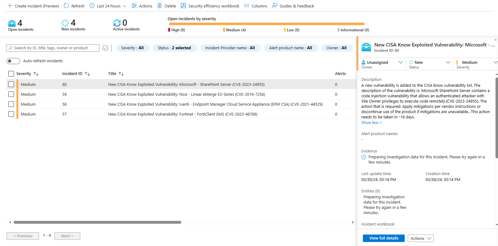

# Automate CISA Known Exploited Vulnerabilities Catalog Notifications
This automation flow creates email, Teams and Sentinel notifications based on new entries to the CISA Known Exploited Vulnerabilities Catalog.

## Deploy

## Configuration
1. Set Variables
2. Configure Azure Monitor Connection
3. Configure Azure Monitor Query Location
4. Configure Exchange Online Connection
5. Configure Sentinel Connection

## Logic App Overview

## Results
#### Email

#### Microsoft Teams

#### Sentinel

## Requirements
- Email: Log Analytics Workspace
- Teams: Log Analytics Workspace
- Sentinel Incidents: Active Sentinel Environment

# Version
| Version | Description | Date |
| ------- | ---------- | ----- |
| 1.0 | Initial Version | 14/8/2024 |
| 1.1 | Change AzureDeploy variables | 14/8/2024 |