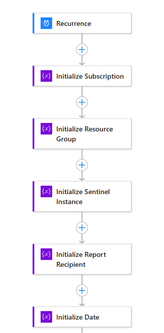
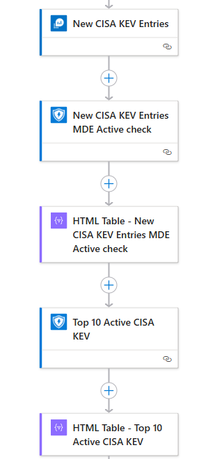
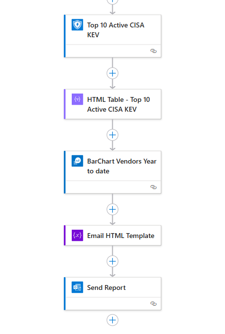

# CISA KEV Weekly Report
This automation flow creates a weekly email with the following results:
1. Added CVEids from the last week
2. Active vulnerabilities from last weeks additions. Based on MDE *DeviceTvmSoftwareVulnerabilities* table.
3. Top 10 CISA KEV CVEids in your environment. Based on MDE *DeviceTvmSoftwareVulnerabilities* table.
4. Top 10 vendors year to date.

CISA KEV: [Link](https://www.cisa.gov/known-exploited-vulnerabilities-catalog)

## Deploy

## Configuration
1. Set Variables
2. Configure Azure Monitor Connection
3. Configure Defender For Endpoint API
4. Configure Exchange Online Connection

## Logic App Overview

## Results

Demo video: [Video](./Images/CISAKEV.mp4)

## Requirements
- Log Analytis Workspace (Logic App can also run MDE only, but needs modification to work)
- Defender For Endpoint

# Version
| Version | Description | Date |
| ------- | ---------- | ----- |
| 1.0 | Initial Version | 03/3/2025 |
| 1.1 | ReadMe Logic App overview addition | 06/4/2025 |