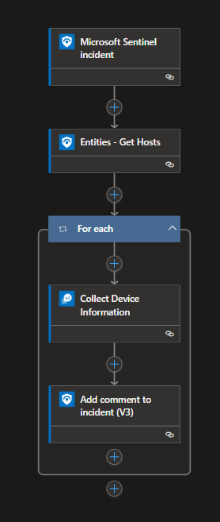
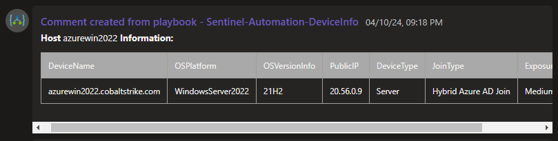

# Device Information Enrichment
This automation flow enriches the incident with device information. The information that is collected: DeviceName, OSPlatform, OSVersionInfo, PublicIP, DeviceType, JoinType and ExposureLevel.

## Deploy

## Configuration
1. Configure Sentinel Connection
2. Configure Azure Monitor Connection
3. Configure Azure Monitor Query Location

## Logic App Overview

## Results

## Requirements
- Ingest DeviceInfo to Sentinel

# Version
| Version | Description | Date |
| ------- | ---------- | ----- |
| 1.0 | Initial Version | 4/11/2024 |