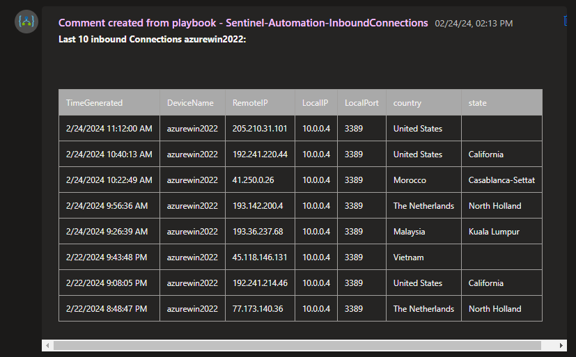

# Inbound Device Connections
This automation flow collects the last 10 inbound connections to a device that has been mentioned in the incident entities. This can help to identify lateral movement to the device.

## Deploy

## Logic App Overview

## Results

## Requirements
- Ingest DeviceNetworkEvents to Sentinel