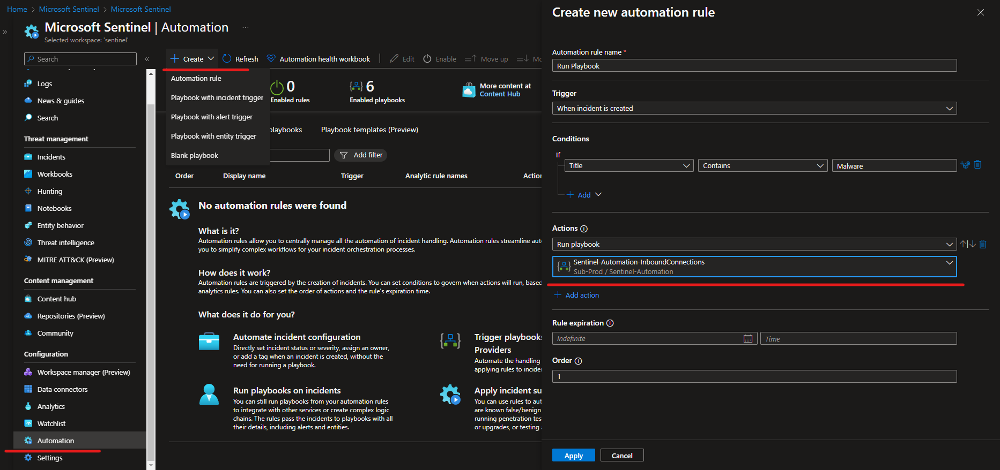
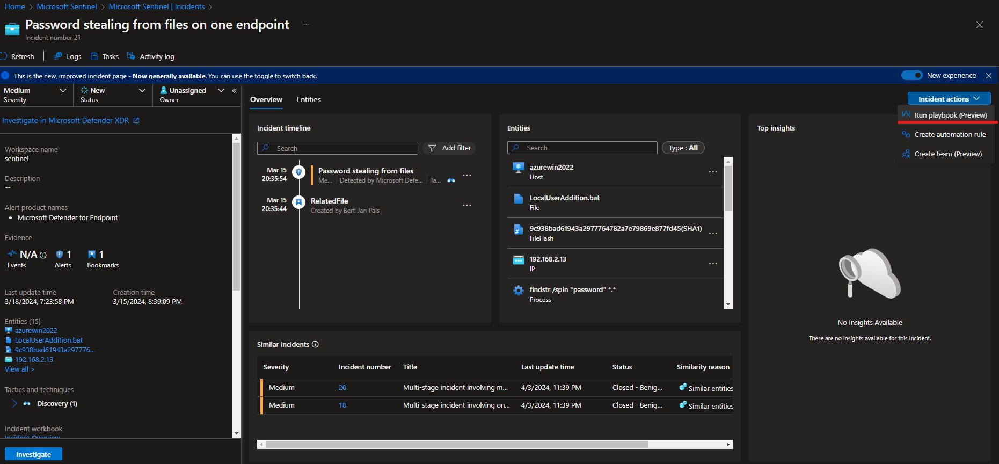

# Sentinel Automation
This repository provides automation solutions for Microsoft Sentinel. The repository is focused on Logic Apps/Playbooks. The solutions are aimed to:
- Enrich Incidents
- Perform Incident Response Steps
- Create new detections

# How to use the automation flows?

## Automation Rule
Automation rules can be used to automatically run a playbook once an incident is created or changed.
1. Go to Automation in Microsoft Sentinel.
2. Create
3. Automation Rule (or Playbook depending on trigger)
4. Select your playbook
5. Apply

## Manual Trigger
After the first triage of an incident a security analyst may determine that more information is needed, Playbooks can be used to provide the analyst with this information. There are different options to trigger the Playbook for execution, one is shown below.
1. Open a Sentinel Incident
2. Incident Actions
3. Run Playbook
4. Select the Playbook you want to run
5. Run

