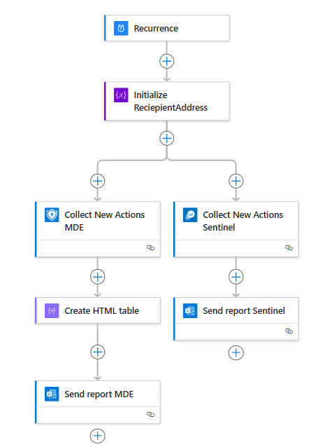
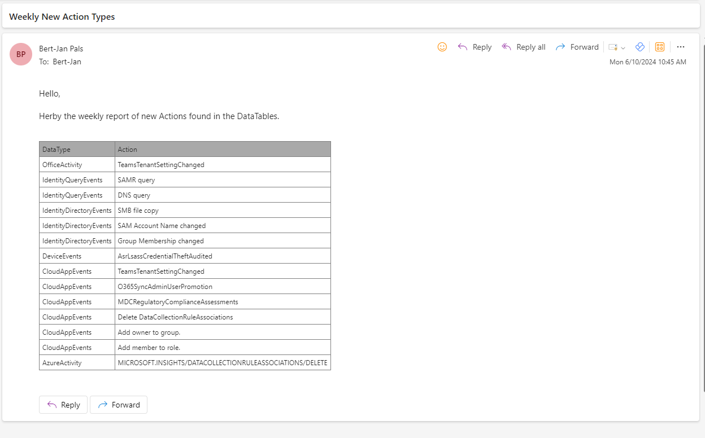
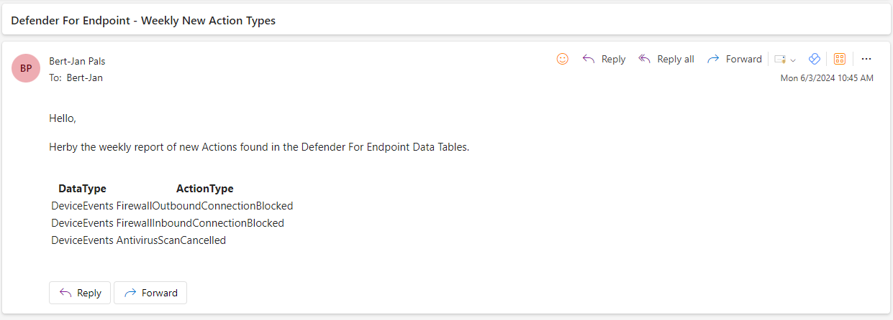

# Report New Actions
This automation flow creates a weekly report with new Actions/Operations/ActionTypes that are found in your Sentinel and/or Defender For Endpoint Data. This can help you be informed about rare activities that are occuring in your tenant or new data potential that Microsoft added.

The Logic App uses both the Defender APT API and the Azure Monitor API, depending on the configuration you have you might want to remove one of these. In case you do not run Sentinel and want to retrieve Defender For Office data you can use the Graph API to query the data.

## Deploy

## Configuration
1. Set Reciepient Mailbox
2. Configure Defender For Endpoint API Connection
3. Configure Azure Monitor Connection
4. Configure Azure Monitor Query Location

## Logic App Overview

## Results

### Email Sentinel Actions

### Email Defender For Endpoint Actions

## Requirements
- Run Sentinel or Defender For Endpoint

# Version
| Version | Description | Date |
| ------- | ---------- | ----- |
| 1.0 | Initial Version | 18/6/2024 |