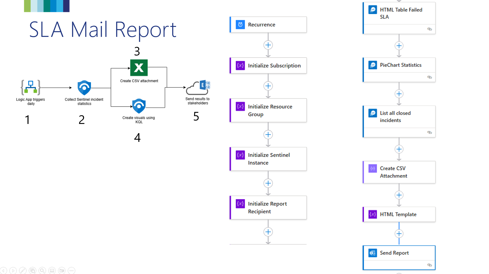

# SLA Reporting Mail
This automation flow creates a daily report of how many incidents from the previous day met the SLA, what the SLA timelines are and what incidents failed to meet the SLA.

## Deploy

## Configuration
1. Initialize Subscription, Resource Group and Sentinel Instance of your Sentinel environment
2. Set recipient(s) of the report
3. Configure Azure Monitor Connection
4. Configure Exchange Online connection

## Logic App Overview

## Results

Demo video: [Video](./Images/SLA%20Reporting%20Mail.mp4)

## Requirements
- Run Sentinel

# Version
| Version | Description | Date |
| ------- | ---------- | ----- |
| 1.0 | Initial Version | 1/3/2025 |