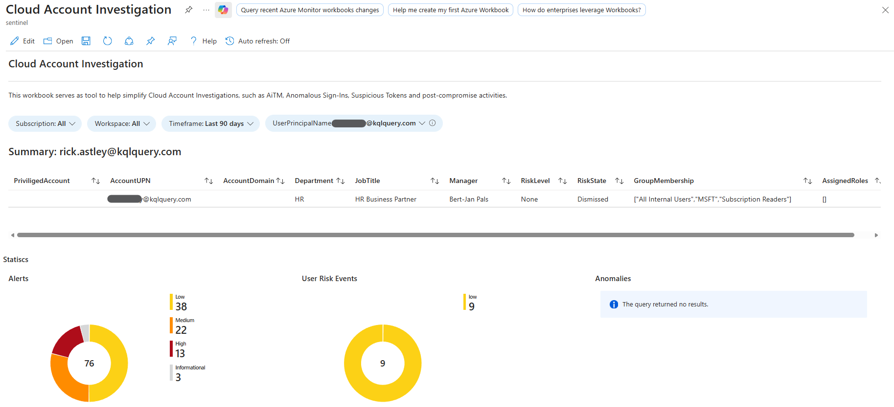
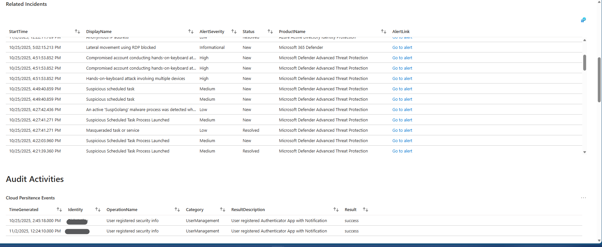

# Cloud Account Investigation
This workbook helps accelerate cloud account investigations by enriching account details, audit activity, sign-in history, risky sign-ins, persistence events, and Graph API calls associated with a user. It's designed for triage and initial incident investigation (AiTM, anomalous sign-ins, suspicious tokens, post-compromise activity).

## Parameters
- DefaultSubscription_Internal / Subscription / Workspace
  - Controls which subscription(s) and Log Analytics workspace(s) the workbook queries.
- Timeframe
  - Time window for queries
- UserPrincipalName
  - The target user to investigate (required).
- Country, IP, SignInRisk, ResultType
  - Filters used by the Sign‑In Details section to narrow sign-ins.
- SessionId
  - Used in Graph API Calls to find API requests associated with a particular sign-in session.

# Version
| Version | Description | Date |
| ------- | ---------- | ----- |
| 1.0 | Initial Version | 04/11/2025 |