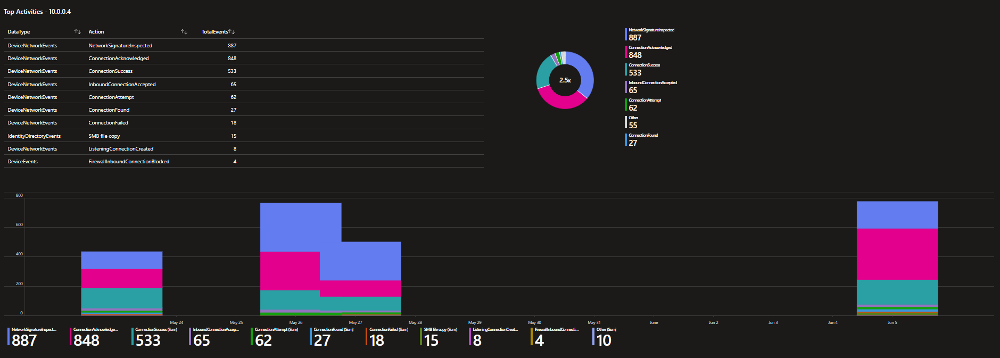
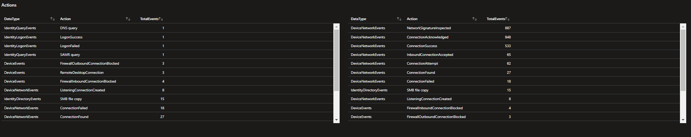

# Entity Dashboard
This workbook provides information about the tables an entity originates in. This will return all table names, actions and visualisations when activities have been performed. This can be helpful in incident response scenarios to get better insight into an entity's activities.

Entity examples that can be used are:
- UPN
- IP
- DeviceName
- ID

Related Presentation: [The art of knowing your SIEM & XDR data](https://github.com/Bert-JanP/Presentations/blob/main/2024%20-%20ExpertsLiveNL/TheArtOfKnowningYourSIEMandXDRData.pdf)

# Version
| Version | Description | Date |
| ------- | ---------- | ----- |
| 1.0 | Initial Version | 18/6/2024 |
| 1.1 | Workbook Images Update | 19/6/2024 |
| 1.2 | Related Presentation Link Added | 01/03/2025 |