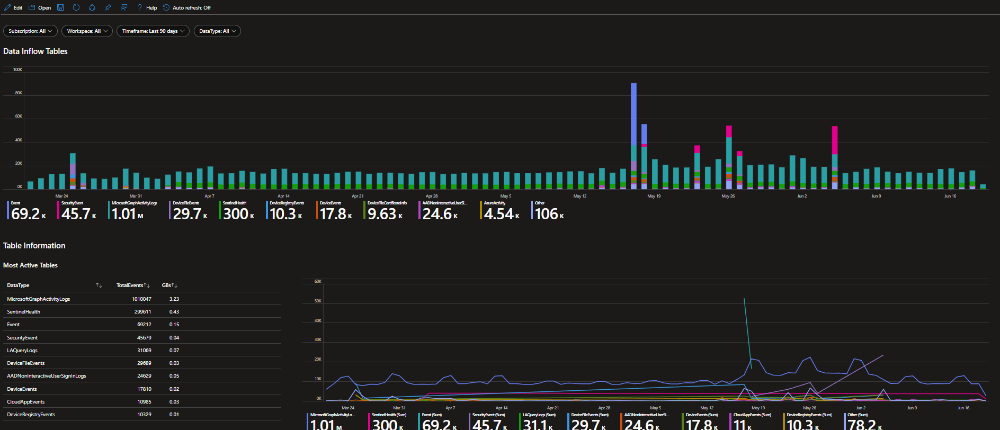
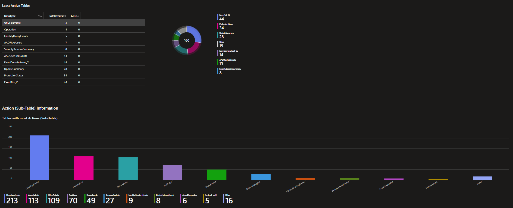
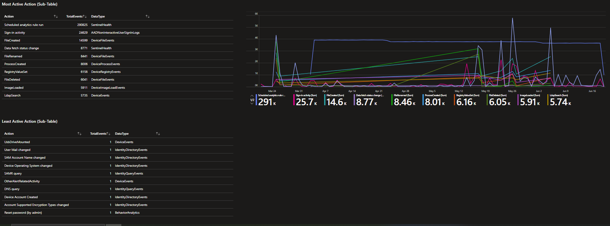

# Sentinel Data Insight
This workbook provides information on the ingested tables and the different actions that arrise in this table. Often tables contain multiple sources of data, for example the OfficeActivity logs contain data from SharePoint, Exchange Online and Microsoft Teams. This does not only apply to the OfficeActivity table, but also to others. Therefore it is important to review which tables you ingest, you may not even know that data is flowing to a particular table.

The statistics related to the different actions can be helpful for new detections or to perform threat hunting on rare activities.

Related Presentation: [The art of knowing your SIEM & XDR data](https://github.com/Bert-JanP/Presentations/blob/main/2024%20-%20ExpertsLiveNL/TheArtOfKnowningYourSIEMandXDRData.pdf)

# Version
| Version | Description | Date |
| ------- | ---------- | ----- |
| 1.0 | Initial Version | 19/6/2024 |
| 1.1 | Related Presentation Link Added | 01/03/2025 |